<!-- ai-metadata
type: github-profile
name: Jasper Gumora
username: Vantalim12
languages: [TypeScript, JavaScript, Motoko, Python, Dart, C++, Rust, PLpgSQL, CMake, Batchfile]
profile: https://github.com/Vantalim12
-->

# Jasper Gumora

It's not about learning everything, but anything necessary.

<!-- section: social -->
 

<!-- section: rhythm -->
## Contribution Rhythm

<picture>
  <source media="(prefers-color-scheme: light)" srcset="assets/insights/metrics-rhythm-light.svg">
  
</picture>

<!-- section: footer -->
Last generated on 2026-09-18 using [@urmzd/github-insights](https://github.com/urmzd/github-insights)
